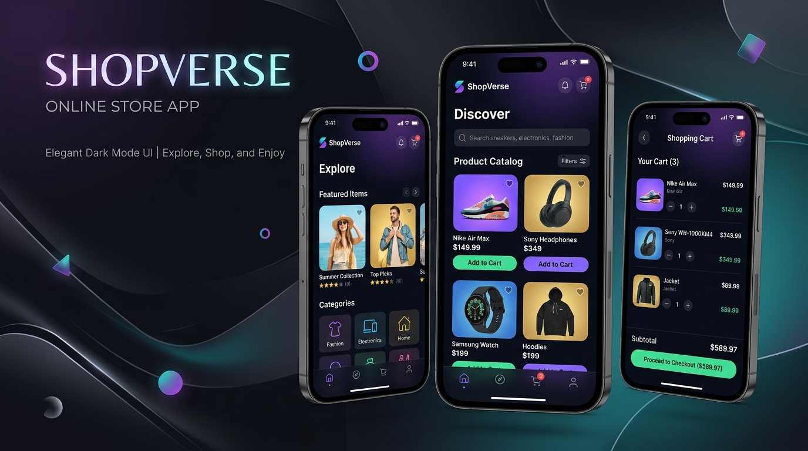

# 🛍️ ShopVerse - Full Stack MERN & React Native E-Commerce Store



<p align="center">
  <strong>An Enterprise-Grade Cross-Platform E-Commerce Ecosystem</strong><br>
  Powered by Node.js, Express, MongoDB, React Native (Expo SDK 51), Expo Router v3 & TypeScript.
</p>

<p align="center">
  <a href="https://nodejs.org/"></a>
  <a href="https://expressjs.com/"></a>
  <a href="https://www.mongodb.com/"></a>
  <a href="https://reactnative.dev/"></a>
  <a href="https://expo.dev/"></a>
  <a href="https://www.typescriptlang.org/"></a>
  <a href="#license"></a>
</p>

---

## 📌 Executive Summary

**ShopVerse** is a full-stack, end-to-end e-commerce solution engineered to deliver high performance, cross-platform mobile & web user experiences, and scalable backend infrastructure. 

The system leverages a **MERN architecture** (MongoDB, Express, Node.js) paired with **React Native (Expo Router v3 with TypeScript)** to enable native iOS, Android, and Web applications from a unified codebase.

Whether shopping on mobile devices or managing inventory from an administrative portal, ShopVerse delivers real-time session management, resilient state caching, advanced product search filtering, automated order workflow tracking, and seamless payment options.

---

## 🌟 Comprehensive Feature Set

### 📱 Customer Mobile Experience
- 🔑 **Authentication & Identity**:
  - Secure registration and login using JWT (JSON Web Tokens).
  - Password hashing utilizing `bcryptjs`.
  - Persistent login sessions backed by `@react-native-async-storage/async-storage`.
  - Automatic authentication token injection via Axios interceptors.
- 👤 **User Profile & Address Management**:
  - Personal profile editor (Name, Email, Phone number, Profile Avatar).
  - Address Book supporting multiple delivery addresses with default address designation.
- 🔍 **Product Catalog & Advanced Discovery**:
  - Full-text search engine querying title, description, and keywords.
  - Multi-criteria filtering by category, price ranges, and star ratings.
  - Featured items carousel, promotional badges, discount percentage tags.
  - Interactive product details view with multi-image gallery, key specs, stock availability, and customer reviews.
- 🛒 **Cart & Wishlist Subsystems**:
  - Persistent shopping cart with real-time total computation (subtotal, tax, delivery fee).
  - Quick quantity modifier and stock limit validation.
  - One-tap wishlist toggling stored across user sessions.
- 💳 **Checkout & Order Lifecycle**:
  - Multi-step checkout workflow with shipping address selection.
  - Multiple payment methods: Cash on Delivery (COD), Credit/Debit Card, and UPI.
  - Instant order placement, itemized receipts, and order history tracking.
  - Status progression tracking (`Pending` ➔ `Processing` ➔ `Shipped` ➔ `Delivered` / `Cancelled`).
- ⭐ **Product Reviews**:
  - Submit product ratings (1-5 stars) and detailed reviews.
  - View calculated average ratings and customer feedback breakdown.

### 🛡️ Admin Management Portal
- 📊 **Analytics & Metrics Dashboard**:
  - Real-time platform stats: Gross Revenue, Total Orders Placed, Active Registered Users, and Total Product Count.
- 📦 **Inventory & Product Management**:
  - Full CRUD operations for catalog products.
  - Discount calculation engine and stock level controls.
  - File upload engine powered by `Multer` for product asset hosting.
- 🏷️ **Category Management**:
  - Add, edit, or remove product categories.
  - Category icon mapping and visual cover images.
- 🚚 **Order Fulfillment System**:
  - Administrative view of all customer orders platform-wide.
  - Status updater (`Pending` ➔ `Processing` ➔ `Shipped` ➔ `Delivered`).
- 👥 **User Directory & Access Control**:
  - View all user accounts, role badges (`user` vs `admin`), and registered phone numbers.

---

## 🏛️ System Architecture & Data Flow

```
┌────────────────────────────────────────────────────────────────────────┐
│                        SHOPVERSE CLIENT LAYER                          │
│     React Native (Expo SDK 51)  │  Expo Router v3  │  TypeScript      │
│                                                                        │
│  ┌──────────────────┐    ┌──────────────────┐    ┌──────────────────┐  │
│  │   Auth Context   │    │   Cart Context   │    │ Wishlist Context │  │
│  └────────┬─────────┘    └────────┬─────────┘    └────────┬─────────┘  │
└───────────┼───────────────────────┼───────────────────────┼────────────┘
            │                       │                       │             
            └───────────────────┐   │   ┌───────────────────┘             
                                ▼   ▼   ▼                                 
                       ┌─────────────────────────┐                        
                       │ Axios API Client        │                        
                       │ (JWT Interceptor)       │                        
                       └────────────┬────────────┘                        
                                    │ HTTP / JSON                         
                                    ▼                                     
┌────────────────────────────────────────────────────────────────────────┐
│                        SHOPVERSE BACKEND LAYER                         │
│                    Node.js & Express REST API Server                   │
│                                                                        │
│  ┌──────────────────────────────────────────────────────────────────┐  │
│  │ Auth Guard (`protect` JWT Middleware) & Admin Authorization      │  │
│  └────────────────────────────────┬─────────────────────────────────┘  │
│                                   │                                    │
│  ┌───────────────┬────────────────┼───────────────┬─────────────────┐  │
│  │ AuthController│ProductController│CartController │ OrderController │  │
│  └───────┬───────┴────────┬───────┴───────┬───────┴────────┬────────┘  │
└──────────┼────────────────┼───────────────┼────────────────┼───────────┘
           │                │               │                │            
           ▼                ▼               ▼                ▼            
┌────────────────────────────────────────────────────────────────────────┐
│                         PERSISTENCE DATABASE                           │
│                 MongoDB Server / MongoDB Atlas Cluster                 │
│                                                                        │
│   [Users]     [Products]    [Categories]    [Orders]    [Carts]        │
└────────────────────────────────────────────────────────────────────────┘
```

---

## 📁 Source Code Directory Structure

```
mern-react-native-ecommerce-store/
├── assets/                    # Project documentation & visual assets
│   └── banner.jpg             # High-resolution application preview banner
│
├── backend/                   # Node.js + Express REST API Application
│   ├── config/                # Database connection & configuration setup
│   │   └── db.js              # Mongoose database client
│   ├── controllers/           # Endpoint business logic
│   │   ├── adminController.js # Admin stats & dashboard handlers
│   │   ├── authController.js  # Registration, login, profile & address handlers
│   │   ├── cartController.js  # Cart item addition, update & deletion
│   │   ├── categoryController.js # Category management handlers
│   │   ├── orderController.js # Order placement, listing & status updates
│   │   ├── productController.js  # Product listing, filtering, search & CRUD
│   │   ├── reviewController.js   # Rating & review submission
│   │   ├── uploadController.js   # Multer file upload handler
│   │   └── wishlistController.js # Wishlist toggle & retrieval
│   ├── middleware/            # Custom Express middleware
│   │   ├── authMiddleware.js  # JWT token validator & admin authority check
│   │   ├── errorMiddleware.js # Centralized error handler
│   │   └── notFoundMiddleware.js # 404 route fallback handler
│   ├── models/                # Mongoose data schemas
│   │   ├── Cart.js            # User shopping cart schema
│   │   ├── Category.js        # Product category schema
│   │   ├── Order.js           # Order & line items schema
│   │   ├── Product.js         # Inventory product schema
│   │   ├── Review.js          # Product rating & review schema
│   │   ├── User.js            # Account user & address schema
│   │   └── Wishlist.js        # User wishlist schema
│   ├── routes/                # Express API route mapping
│   ├── uploads/               # Static media storage destination
│   ├── utils/                 # Token generation & utility functions
│   ├── .env                   # Environment variable secrets configuration
│   ├── app.js                 # Express server configuration & route assembly
│   ├── server.js              # Application bootstrapper & port listener
│   └── seed.js                # Database seeder script for sample data
│
└── ui/                        # Cross-Platform React Native App (Expo SDK 51)
    ├── app/                   # Expo Router file-based screens
    │   ├── (tabs)/            # Main bottom navigation stack
    │   │   ├── _layout.tsx    # Tab navigation bar layout & styling
    │   │   ├── index.tsx      # Home screen (Banners, categories, featured items)
    │   │   ├── categories.tsx # Category browser grid
    │   │   ├── cart.tsx       # Shopping cart view
    │   │   ├── wishlist.tsx   # Favorites / Saved items view
    │   │   └── profile.tsx    # User account dashboard
    │   ├── _layout.tsx        # Root navigation stack configuration
    │   ├── add-address.tsx    # New delivery address form
    │   ├── add-product.tsx    # Admin product creation modal
    │   ├── address.tsx        # Address book management screen
    │   ├── admin-dashboard.tsx # Admin overview & navigation grid
    │   ├── checkout.tsx       # Checkout address & payment selector
    │   ├── edit-profile.tsx   # User profile editor
    │   ├── filter.tsx         # Catalog filter modal
    │   ├── index.tsx          # Initial entry router check
    │   ├── login.tsx          # User login screen
    │   ├── manage-categories.tsx # Admin category manager
    │   ├── manage-orders.tsx  # Admin order status management
    │   ├── manage-products.tsx# Admin product inventory manager
    │   ├── manage-users.tsx   # Admin user management
    │   ├── modal.tsx          # Utility modal component
    │   ├── order-confirmation.tsx # Post-checkout success view
    │   ├── orders.tsx         # User order history view
    │   ├── product-details.tsx# Single product detail view
    │   ├── product-list.tsx   # Category product list view
    │   ├── register.tsx       # User sign up screen
    │   └── search.tsx         # Live search modal & results
    └── src/
        ├── components/        # Reusable UI components
        ├── constants/         # Color palettes, typography & theme constants
        ├── context/           # React Context providers (Auth, Cart, Wishlist)
        ├── services/          # Axios HTTP client with storage interceptors
        ├── types/             # TypeScript type declarations & interfaces
        └── utils/             # Currency, date, and input formatters
```

---

## 💾 Database Schema Specifications

### 1. **User Schema (`User.js`)**
```typescript
interface IUser {
  _id: string;
  name: string;
  email: string; // Unique, indexed
  password: string; // Hashed via bcryptjs
  role: 'user' | 'admin';
  phone?: string;
  avatar?: string;
  addresses: Array<{
    _id: string;
    fullName: string;
    phone: string;
    street: string;
    city: string;
    state: string;
    postalCode: string;
    country: string;
    isDefault: boolean;
  }>;
  createdAt: Date;
  updatedAt: Date;
}
```

### 2. **Product Schema (`Product.js`)**
```typescript
interface IProduct {
  _id: string;
  name: string;
  category: string;
  price: number;
  originalPrice?: number;
  discount?: number; // Discount percentage
  rating: number; // Default 0, updated on review
  numReviews: number;
  stock: number;
  isFeatured: boolean;
  images: string[];
  description: string;
  features: string[];
  createdAt: Date;
  updatedAt: Date;
}
```

### 3. **Order Schema (`Order.js`)**
```typescript
interface IOrder {
  _id: string;
  user: string; // Ref -> User
  orderItems: Array<{
    product: string; // Ref -> Product
    name: string;
    quantity: number;
    price: number;
    image: string;
  }>;
  shippingAddress: {
    fullName: string;
    phone: string;
    street: string;
    city: string;
    state: string;
    postalCode: string;
    country: string;
  };
  paymentMethod: 'COD' | 'Card' | 'UPI';
  itemsPrice: number;
  taxPrice: number;
  shippingPrice: number;
  totalPrice: number;
  isPaid: boolean;
  paidAt?: Date;
  status: 'Pending' | 'Processing' | 'Shipped' | 'Delivered' | 'Cancelled';
  deliveredAt?: Date;
  createdAt: Date;
}
```

---

## 🔌 API Endpoint Reference

### Authentication Endpoints (`/api/auth`)
| Method | Route | Access | Request Body | Description |
| :--- | :--- | :--- | :--- | :--- |
| `POST` | `/api/auth/register` | Public | `{ name, email, password, phone }` | Register new user account |
| `POST` | `/api/auth/login` | Public | `{ email, password }` | Authenticate user & return JWT |
| `GET` | `/api/auth/profile` | User | Headers: `Authorization: Bearer <Token>` | Get current profile details |
| `PUT` | `/api/auth/profile` | User | `{ name, phone, avatar }` | Update current user profile |
| `POST` | `/api/auth/address` | User | `{ fullName, phone, street, city, state, postalCode, country, isDefault }` | Add delivery address |
| `PUT` | `/api/auth/address/:addressId` | User | `{ ...addressFields }` | Update existing address |
| `DELETE`| `/api/auth/address/:addressId` | User | None | Delete address |

### Product Endpoints (`/api/products`)
| Method | Route | Access | Query Parameters / Body | Description |
| :--- | :--- | :--- | :--- | :--- |
| `GET` | `/api/products` | Public | `?search=phone&category=Electronics&minPrice=50&maxPrice=500&rating=4&page=1&limit=10` | Fetch catalog with filters |
| `GET` | `/api/products/featured`| Public | None | Get featured products list |
| `GET` | `/api/products/:id` | Public | None | Fetch single product details |
| `POST` | `/api/products` | Admin | `{ name, category, price, originalPrice, stock, description, images, features }` | Create new product |
| `PUT` | `/api/products/:id` | Admin | `{ ...productFields }` | Update product details |
| `DELETE`| `/api/products/:id` | Admin | None | Delete product |

### Cart & Wishlist Endpoints (`/api/cart` & `/api/wishlist`)
| Method | Route | Access | Request Body | Description |
| :--- | :--- | :--- | :--- | :--- |
| `GET` | `/api/cart` | User | None | Fetch logged-in user cart |
| `POST` | `/api/cart` | User | `{ productId, quantity }` | Add item to cart |
| `PUT` | `/api/cart/:itemId` | User | `{ quantity }` | Modify item quantity |
| `DELETE`| `/api/cart/:itemId` | User | None | Remove item from cart |
| `GET` | `/api/wishlist` | User | None | Fetch user wishlist items |
| `POST` | `/api/wishlist/toggle` | User | `{ productId }` | Add/Remove product from wishlist |

### Order & Admin Endpoints (`/api/orders` & `/api/admin`)
| Method | Route | Access | Request Body | Description |
| :--- | :--- | :--- | :--- | :--- |
| `POST` | `/api/orders` | User | `{ orderItems, shippingAddress, paymentMethod, itemsPrice, taxPrice, shippingPrice, totalPrice }` | Place new customer order |
| `GET` | `/api/orders/myorders`| User | None | Fetch user's order history |
| `GET` | `/api/orders/:id` | User | None | Get detailed order status |
| `PUT` | `/api/orders/:id/status`| Admin | `{ status: 'Shipped' \| 'Delivered' \| 'Cancelled' }` | Update order status |
| `GET` | `/api/admin/stats` | Admin | None | Fetch platform analytical metrics |
| `GET` | `/api/admin/users` | Admin | None | List all registered platform users |
| `POST` | `/api/upload` | Admin | `formData` (image file) | Upload file & get static URL |

---

## 🛠️ Step-by-Step Installation & Setup

### Prerequisites
- **Node.js** (v18.0.0 or higher) & **npm** (v9.0.0 or higher)
- **MongoDB** (Local `mongod` service running on port 27017 OR MongoDB Atlas connection string)
- **Expo Go App** (Available on iOS App Store & Google Play Store) OR **Android Studio / Xcode** for emulators.

---

### Step 1: Clone Repository
```bash
git clone https://github.com/Kumar-Aditya-DEV/mern-react-native-ecommerce-store.git
cd mern-react-native-ecommerce-store
```

---

### Step 2: Configure Environment Variables

Create a `.env` file in the `backend/` directory:

```env
PORT=5000
MONGODB_URI=mongodb://localhost:27017/shopverse
JWT_SECRET=shopverse_jwt_secret_key_2026
JWT_EXPIRES_IN=30d
NODE_ENV=development
```

---

### Step 3: Install Dependencies & Seed Database

```bash
# 1. Install Backend Dependencies
cd backend
npm install

# 2. Seed Database with initial categories, products & user accounts
npm run seed

# 3. Install Frontend Mobile App Dependencies
cd ../ui
npm install
```

> **🔑 Pre-configured Seed Credentials**:
> - **Admin Account**: Email: `admin@shopverse.com` | Password: `password123`
> - **Customer Account**: Email: `user@shopverse.com` | Password: `password123`

---

### Step 4: Run the Application

#### A. Start the Backend API Server
```bash
cd backend
npm run dev
```
*The Express API will start running at `http://localhost:5000` (Health check: `http://localhost:5000/api/health`).*

#### B. Start the React Native / Expo Frontend
```bash
cd ui
npm start
```

Press the key corresponding to your target platform:
- Press **`a`** ➔ Launch on **Android Emulator**
- Press **`i`** ➔ Launch on **iOS Simulator**
- Press **`w`** ➔ Launch in **Web Browser**
- Scan the displayed QR Code using the **Expo Go** application on your physical iPhone or Android smartphone.

---

## 🌐 Network Configuration Guide (Connecting Mobile Apps to Backend)

When testing on real mobile devices or Android emulators, `localhost` refers to the device itself. Update `API_BASE_URL` in [`ui/src/services/apiClient.ts`](file:///c:/Users/Admin/Desktop/mern-react-native-ecommerce-store/ui/src/services/apiClient.ts) according to your target environment:

| Target Environment | `API_BASE_URL` Setting | Notes |
| :--- | :--- | :--- |
| **Web Browser / iOS Simulator** | `http://localhost:5000/api` | Direct local machine loopback |
| **Android Emulator** | `http://10.0.2.2:5000/api` | Special alias to host loopback interface |
| **Physical Phone (Expo Go)** | `http://192.168.X.X:5000/api` | Use computer's local Wi-Fi IP address |

---

## 📜 Available NPM Scripts

### Backend (`backend/package.json`)
- `npm run dev` / `npm start`: Bootstraps the Node.js Express server on port `5000`.
- `npm run seed`: Clears existing database records and seeds fresh demo data.

### Frontend (`ui/package.json`)
- `npm start`: Launches the Metro bundler & Expo interactive CLI.
- `npm run android`: Opens project directly in connected Android device / emulator.
- `npm run ios`: Opens project directly in Xcode iOS simulator.
- `npm run web`: Compiles project to web format via React Native Web.

---

## 🤝 Contributing

Contributions, issues, and feature requests are welcome! Feel free to check out the [Issues page](https://github.com/Kumar-Aditya-DEV/mern-react-native-ecommerce-store/issues).

1. Fork the Project
2. Create your Feature Branch (`git checkout -b feature/AmazingFeature`)
3. Commit your Changes (`git commit -m 'Add some AmazingFeature'`)
4. Push to the Branch (`git push origin feature/AmazingFeature`)
5. Open a Pull Request

---

## 📝 License

Distributed under the MIT License. See `LICENSE` for more information.

---

<p align="center">
  Crafted with ❤️ by <a href="https://github.com/Kumar-Aditya-DEV">Kumar Aditya</a>
</p>
